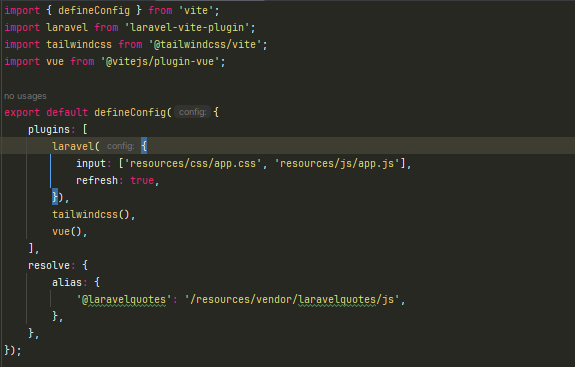

# Laravel Quotes Package (Laravel 12)

<p style="text-align: center">
    <a href="./README.MD">English / Inglés</a>
</p>

Paquete para mostrar citas con integración de API, Inertia.js, VUE 3 y Tailwind CSS.

## Requisitos
- PHP 8.2+
- Laravel 12+
- Node.js 22+
- Composer 2.6+

## Instalación

1. Instala un proyecto Laravel 12+
2. Edita el `composer.json` de la aplicación y añade el repositorio del paquete manualmente en la sección `repositories`
```json
...
"license": "MIT",
"repositories": [
    {
    "type": "git",
    "url": "https://github.com/EymerLopez/laravelquotespackage.git"
    }
],
"require": {
...
}
```
3. Instalar el paquete ejecutando `composer require eymer/laravelquotes`
4. Añade al `bootstrap/app.php` el middleware de inertia dentro la función ``withMiddleware``
```php
        ->withMiddleware(function (Middleware $middleware) {
            ...
            $middleware->web(append: [
                \Eymer\LaravelQuotes\Http\Middleware\HandleInertiaRequests::class,
            ]);
            ...
        })
```
5. Publica los archivos necesarios para compilar los assets y vistas del paquete con el siguiente comando:
```bash
    php artisan laravelquotes:install
```
5. Instala las dependencias js. Laravel 12 por defecto viene con Tailwinds CSS y VITE por lo que no es necesario instalarlas, así que instalaremos lo siguiente:
```bash
    npm install @inertiajs/vue3  
    npm install @vitejs/plugin-vue  
```
6. Importa al `resources/js/app.js` de la aplicación el `app.js` del paquete
```js
    import './bootstrap';
    ...
    import './../vendor/laravelquotes/js/app.js';
    ...
```
7. Importa al `resources/js/app.css` de la aplicación el `app.css` del paquete
```scss
    @import 'tailwindcss';
    ...
    @import '../vendor/laravelquotes/css/app.css';
    ...
```
8. Importa y añade al `vite.config.js` de la aplicación los plugins de Vue y Tailwind (si no está importado).
```js
    import { defineConfig } from 'vite';
    ...
    import tailwindcss from '@tailwindcss/vite';
    import vue from '@vitejs/plugin-vue';
```
- Configura los plugin y alias en el `vite.config.js` de la aplicación:
```js
    plugins: [
        laravel({
            ...
        }),
        ...
        tailwindcss(),
        vue(),
    ],
``` 
- Añade un alias.
```js
    plugins: [
        ...
    ],
    resolve: {
        alias: {
            '@laravelquotes': '/resources/vendor/laravelquotes/js',
        },
    },
```
- El archivo debería verse algo similar a lo siguiente:

  

9. Ejecuta el comando ``npm run build`` para compilar los assets.
10. Prueba.

## Configuración (`config/quotes.php`)
* ``url``: Establece la url por defecto de la página a donde nos vamos a conectar
* ``max_limit_attempts``: Establece por defecto cuántas solicitudes por IP el usuario puede realizar. Por defecto son 200.
* ``max_limit_duration``: Establece por defecto el límite de tiempo en minutos antes de que el usuario pueda realizar solicitudes una vez alcanzado el máximo. Por defecto 1 minuto.

## Rutas API (`api.php`)
Prefijo: `/quotes`

| Método | URI                  | Acción                      | Descripción                          |
|--------|----------------------|----------------------------|--------------------------------------|
| GET    | /quotes              | QuoteController@index      | Listado paginado de citas            |
| GET    | /quotes/random       | QuoteController@random     | Obtener una cita aleatoria           |
| GET    | /quotes/{id}         | QuoteController@show       | Obtener cita específica por ID       |

## Rutas WEB (`web.php`)
Prefijo: `/quotes-ui`

| Método | URI               | Acción                     | Descripción                          |
|--------|-------------------|----------------------------|--------------------------------------|
| GET    | /quotes-ui        | QuoteViewController@index  | Listado paginado de citas            |
| GET    | /quotes-ui/random | QuoteViewController@random | Obtener una cita aleatoria           |
| GET    | /quotes-ui/{id}   | QuoteViewController@show   | Obtener cita específica por ID       |

## Customización

Al momento de publicar el paquete se generan lo archivos css y js dentro la carpeta "resources/vendor/laravelquotes"
- Dentro de la carpeta "css" está el archivo "app.css" donde puedes modificar estilos
- Dentro de la carpeta "js" están los componentes y páginas que hace uso el paquete. Además, se encuentra el archivo "app.js" que es donde crea la app con Inertia.

Adicionalmente en "resources/views/vendor/laravelquotes" se almacena el archivo "app.blade.php" el cual sirve como la plantilla principal. Dicho archivo puede ser personalizado a gusto.

Una vez finalizada la customización recuerda ejecutar nuevamente el comando ``npm run build`` para compilar los assets.