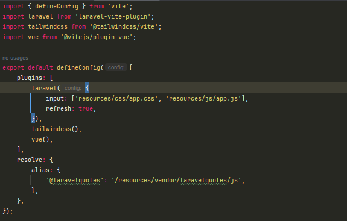

# Laravel Quotes Package (Laravel 12)

<p style="text-align: center">
    <a href="./LEAME.MD">Spanish / Español</a>
</p>

Package for displaying quotes with API integration, Inertia.js, VUE 3, and Tailwind CSS.

## Requirements
- PHP 8.2+
- Laravel 12+
- Node.js 22+
- Composer 2.6+

## Installation

1. Install a Laravel 12+ project.
2. Edit the application's `composer.json` file and manually add the package repository in the `repositories` section:
```json
...
"license": "MIT",
"repositories": [
    {
    "type": "git",
    "url": "https://github.com/EymerLopez/laravelquotespackage.git"
    }
],
"require": {
...
}
```
3. Install the package by running `composer require eymer/laravelquotes`.
4. Add the Inertia middleware to `bootstrap/app.php` inside the `withMiddleware` function.
```php
        ->withMiddleware(function (Middleware $middleware) {
            ...
            $middleware->web(append: [
                \Eymer\LaravelQuotes\Http\Middleware\HandleInertiaRequests::class,
            ]);
            ...
        })
```
5. Publish the files needed to compile the package with the command:
```bash
    php artisan laravelquotes:install
```
6. Install the JS dependencies. Laravel 12 comes with Tailwind CSS and VITE by default, so there's no need to install them. Therefore, we'll install the following:
```bash
    npm install @inertiajs/vue3  
    npm install @vitejs/plugin-vue  
```
7. Import into the application's `resources/js/app.js` the `app.js` from the package:
```js
    import './bootstrap';
    ...
    import './../vendor/laravelquotes/js/app.js';
    ...
```
8. Import into the application's `resources/css/app.css` the `app.css` from the package:
```scss
    @import 'tailwindcss';
    ...
    @import '../vendor/laravelquotes/css/app.css';
    ...
```
9. Import and add the Vue and Tailwind plugins (if not already imported) to the application's `vite.config.js`.
```js
    import { defineConfig } from 'vite';
    ...
    import tailwindcss from '@tailwindcss/vite';
    import vue from '@vitejs/plugin-vue';
```
- Configure the plugins in the application's `vite.config.js`:
```js
    plugins: [
        laravel({
            ...
        }),
        ...
        tailwindcss(),
        vue(),
    ],
``` 
- Add an alias.
```js
    plugins: [
        ...
    ],
    resolve: {
        alias: {
            '@laravelquotes': '/resources/vendor/laravelquotes/js',
        },
    },
```

- The file should look something like this:

  

10. Run the ``npm run build`` command to compile the assets.
11. Test it.

## Configuration (`config/quotes.php`)
* `url`: Sets the default URL of the page to which we will connect.
* `max_limit_attempts`: Sets the default number of requests per IP the user can make. By default, it is 200.
* `max_limit_duration`: Sets the default time limit in minutes before the user can make requests again once the maximum is reached. By default, it is 1 minute.

## API Routes (`api.php`)
Prefix: `/quotes`

| Method | URI                  | Action                      | Description                          |
|--------|----------------------|----------------------------|--------------------------------------|
| GET    | /quotes              | QuoteController@index      | Paginated list of quotes            |
| GET    | /quotes/random       | QuoteController@random     | Get a random quote                   |
| GET    | /quotes/{id}         | QuoteController@show       | Get a specific quote by ID           |

## WEB Routes (`web.php`)
Prefix: `/quotes-ui`

| Method | URI               | Action                     | Description                          |
|--------|-------------------|----------------------------|--------------------------------------|
| GET    | /quotes-ui        | QuoteViewController@index  | Paginated list of quotes            |
| GET    | /quotes-ui/random | QuoteViewController@random | Get a random quote                   |
| GET    | /quotes-ui/{id}   | QuoteViewController@show   | Get a specific quote by ID           |

---

## Customization

When publishing the package, the CSS and JS files are generated inside the resources/vendor/laravelquotes folder:

- Inside the css folder, you'll find the app.css file, where you can modify styles.
- Inside the js folder, you'll find the components and pages used by the package. Additionally, the app.js file is located here, which initializes the Inertia app.

Furthermore, in resources/views/vendor/laravelquotes, you'll find the app.blade.php file, which serves as the main template. This file can be customized as needed.

Once customization is complete, remember to run the ``npm run build`` command again to recompile the assets.